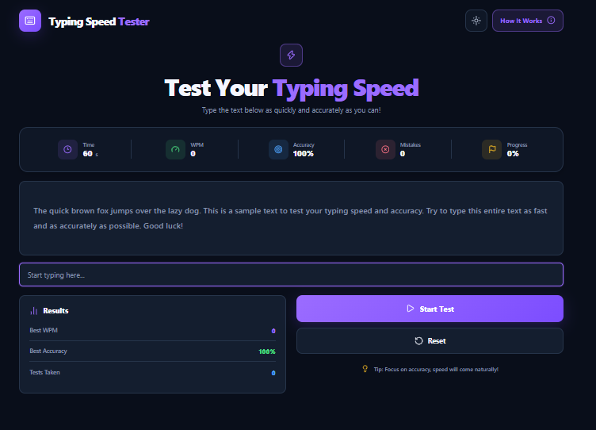

# ⌨️ Typing Speed Tester

A modern and interactive **Typing Speed Tester** built with HTML, CSS and Vanilla JavaScript.

Test your typing speed in real time while tracking **WPM, accuracy, mistakes and progress** through a clean and responsive interface.

## 🚀 Live Demo

🌐 **[Launch Typing Speed Tester](git remote add origin https://github.com/JohnYisBackk/js-typing-speed-tester.git)**

Try the application directly in your browser.

## 📸 Preview

<p align="center">
  
</p>

## ✨ Features

- ⌨️ Real-time typing test
- ⏱️ 60-second countdown timer
- 🚀 Live WPM calculation
- 🎯 Live typing accuracy
- ❌ Mistake counter
- 📊 Typing progress tracking
- 📝 Multiple random typing texts
- 🏆 Best WPM tracking
- 🎯 Best accuracy tracking
- 🔢 Completed tests counter
- 🔄 Reset functionality
- 🌙 Dark / Light mode
- 💾 Theme persistence with LocalStorage
- 📱 Fully responsive design
- 🎨 Modern UI with Lucide icons

## 🧠 How It Works

When the user starts a test, the application randomly selects a text from the available text collection.

```js
const randomIndex = Math.floor(Math.random() * textData.length);

currentText = textData[randomIndex];
```

The timer then starts counting down from 60 seconds.

While the user types, the application continuously calculates:

- Words per minute
- Accuracy
- Mistakes
- Progress

Each typed character is compared with the corresponding character in the original text.

```js
for (let i = 0; i < typedText.length; i++) {
  if (typedText[i] !== currentText[i]) {
    mistakeCount++;
  }
}
```

The test automatically finishes when the timer reaches zero or the entire text has been typed.

## ⚡ WPM Calculation

Typing speed is calculated based on the number of words typed and the elapsed time.

```js
const minutes = elapsedSeconds / 60;

const calculatedWpm = wordsTyped / minutes;
```

The result is displayed as **Words Per Minute (WPM)**.

## 🎯 Accuracy Calculation

Accuracy is calculated from the number of correctly typed characters.

```js
const correctCharacters = typedText.length - mistakes;

const calculatedAccuracy = (correctCharacters / typedText.length) * 100;
```

## 📊 Progress Tracking

Progress represents how much of the current text has been typed.

```js
const calculatedProgress = (typedText.length / currentText.length) * 100;
```

The value is limited to a maximum of 100%.

```js
Math.min(Math.round(calculatedProgress), 100);
```

## 🛠️ Technologies Used

- HTML5
- CSS3
- Vanilla JavaScript
- DOM API
- LocalStorage
- Lucide Icons

## 🧠 What I Practiced

This project helped me practice:

- DOM manipulation
- Event listeners
- Application state
- Arrays
- Random array selection
- `setInterval()`
- `clearInterval()`
- String manipulation
- Character-by-character comparison
- Loops
- Functions and parameters
- Mathematical calculations
- Live UI updates
- Conditional logic
- LocalStorage
- Light / Dark theme handling
- Responsive web design

## 📂 Project Structure

```text
js-typing-speed-tester/
│
├── index.html
├── style.css
├── script.js
├── preview.png
├── README.md
└── LICENSE
```

## 📄 License

This project is licensed under the **MIT License**.
